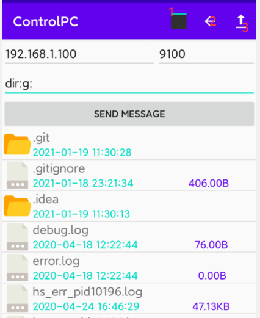

# Introduce

- This app can control the computer that have installed the server
- You should install the server before using the application!!!!
- You can find the server code link as follow: https://github.com/pharoskgg/ControlPC_Server

# Exhibition

1. This is touch tablet
2. Back to the parent directory
3. Upload phone files to the PC

# How to use?

1. Run the server：https://github.com/pharoskgg/ControlPC_Server
2. Enter the corresponding information in the app(IP and port)
3. You will get the IP and port when you run the server in your computer console
4. You should press the button when you have finished typing
5. You also can watch the demo video:https://www.bilibili.com/video/BV1Az4y1S7Gv/
6.  Long press the file to pop up the dialog box 

# command

1.  Get the file directory :      dir:path
2. Send message to PC:      cps:message
3. Use PC to execute cmd command:     cmd:cmd-command